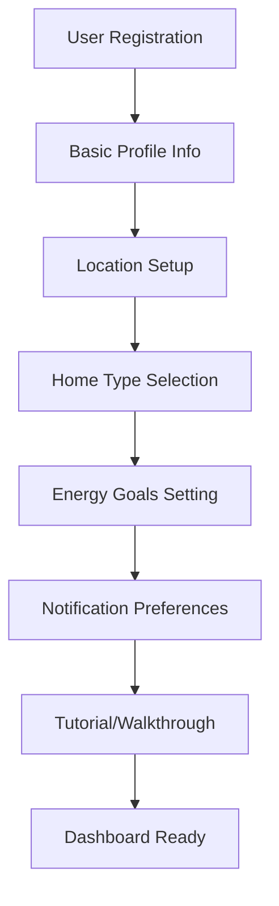
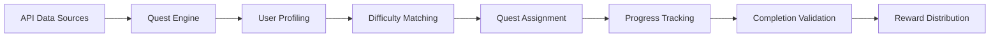
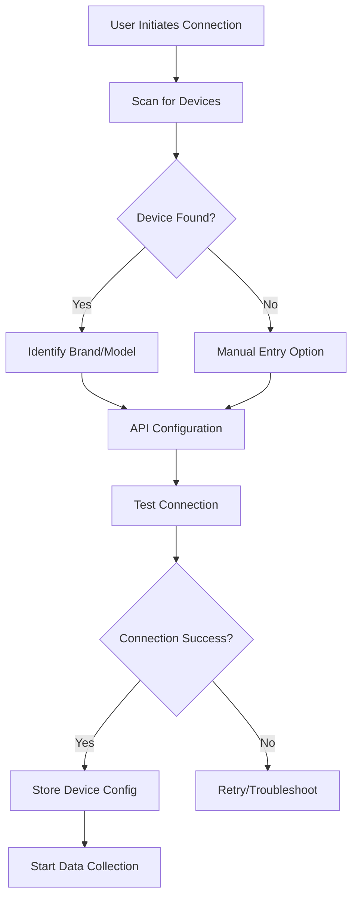
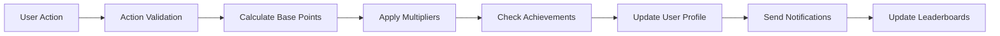
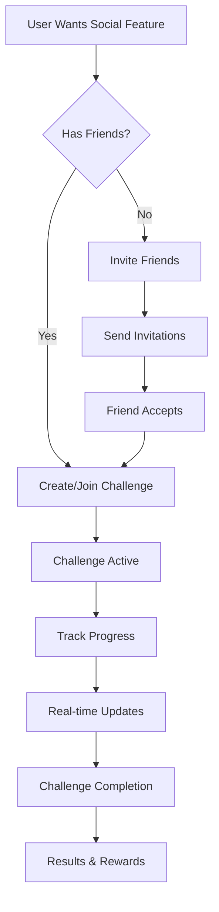
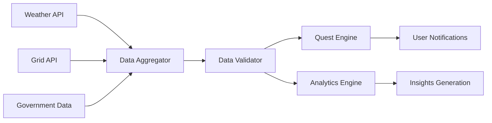
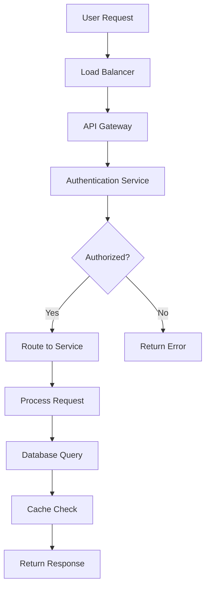
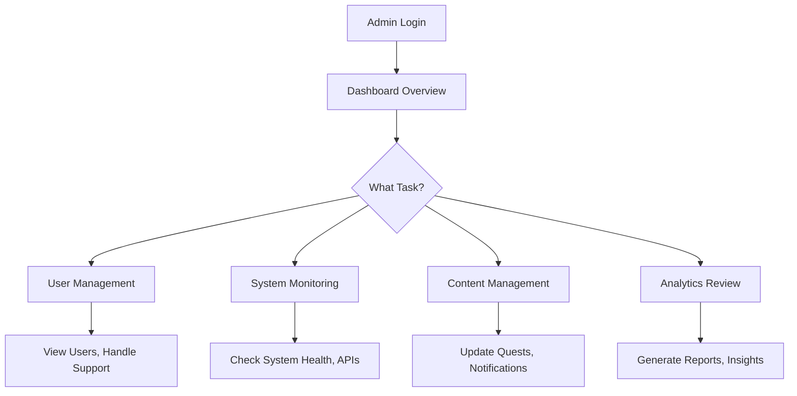
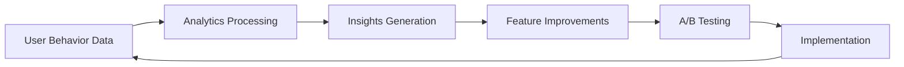

# Gamified Energy-Saving App - Procedure & Workflow Documentation

## 📋 Table of Contents
1. [User Onboarding Flow](#user-onboarding-flow)
2. [Daily User Journey](#daily-user-journey)
3. [Quest Generation & Management](#quest-generation--management)
4. [Smart Meter Integration Workflow](#smart-meter-integration-workflow)
5. [Gamification System Flow](#gamification-system-flow)
6. [Social Features Workflow](#social-features-workflow)
7. [API Data Processing Pipeline](#api-data-processing-pipeline)
8. [System Architecture Flow](#system-architecture-flow)
9. [Error Handling Procedures](#error-handling-procedures)
10. [Admin & Monitoring Workflows](#admin--monitoring-workflows)

---

## 🚀 User Onboarding Flow

### Step 1: Initial Registration
```
User Opens App → Welcome Screen → Registration Options
├── Email Registration
├── Google OAuth
├── Facebook OAuth
└── Guest Mode (Limited Features)
```

### Step 2: Profile Setup


**Detailed Flow:**
1. **Personal Information**
   - Name, Age, Email verification
   - Profile picture upload
   - Household size input

2. **Location & Context**
   - GPS location permission
   - Manual address entry
   - City/region selection for local data

3. **Home Setup**
   - House type (Apartment, Villa, etc.)
   - Approximate house size
   - Number of rooms
   - Primary appliances list

4. **Energy Profile**
   - Current monthly electricity bill
   - Energy saving goals (5%, 10%, 15%, 20%)
   - Preferred challenge difficulty

5. **Preferences**
   - Notification timings
   - Social sharing permissions
   - Data privacy settings

### Step 3: Smart Meter Connection
```
Dashboard → Add Device → Scan QR/Manual Entry → Brand Selection → Connection Test → Success/Retry
```

---

## 🌅 Daily User Journey

### Morning Routine (6:00 AM - 9:00 AM)
```
User Wakes Up → App Push Notification → Open App
├── View Overnight Usage Summary
├── Check Daily Quests
├── Weather-Based Challenge Alert
└── Morning Energy Tip
```

**Detailed Morning Flow:**
1. **Morning Summary Card**
   - Night usage: 3.2 kWh (Good/Average/High)
   - Overnight standby devices detected
   - Weather forecast impact on energy

2. **Daily Quest Assignment**
   - System checks weather API
   - Analyzes user's historical patterns
   - Generates 2-3 daily quests
   - Displays quest cards with rewards

3. **Smart Home Recommendations**
   - "Turn off standby devices" reminder
   - AC temperature suggestions based on weather
   - Optimal times for appliance usage

### Midday Activities (12:00 PM - 2:00 PM)
```
Peak Usage Alert → User Checks App → Current Usage Dashboard → Quest Progress → Action Taken
```

**Midday Monitoring:**
1. **Real-Time Monitoring**
   - Live meter readings display
   - Peak hour warnings
   - Appliance-wise breakdown

2. **Interactive Challenges**
   - "Beat the peak" mini-games
   - Quick 15-minute challenges
   - Instant reward feedback

### Evening Engagement (6:00 PM - 10:00 PM)
```
User Returns Home → App Check-in → Review Day's Performance → Social Leaderboard → Plan Tomorrow
```

**Evening Analysis:**
1. **Daily Performance Review**
   - Quests completed/failed
   - Energy saved vs target
   - Points earned summary
   - Badge progress updates

2. **Social Interaction**
   - Friends' performance comparison
   - Community challenges participation
   - Share achievements

### Night Routine (10:00 PM - 11:00 PM)
```
Sleep Mode Activated → Auto-optimization → Standby Device Check → Tomorrow's Quest Preview
```

---

## 🎯 Quest Generation & Management

### Quest Creation Pipeline


### Quest Types & Triggers

#### 1. Weather-Based Quests
```javascript
// Weather Quest Generation Process
const weatherQuestFlow = {
  step1: "Fetch weather data every 6 hours",
  step2: "Analyze temperature, humidity, conditions",
  step3: "Match weather patterns to quest templates",
  step4: "Customize quest parameters for user",
  step5: "Schedule quest activation",
  step6: "Monitor completion via smart meters"
};

// Example Triggers:
triggers: {
  heatWave: "temp > 35°C → AC optimization quest",
  rainDay: "precipitation > 5mm → natural light quest",
  windyDay: "windSpeed > 20kmh → ventilation quest",
  coolMorning: "temp < 20°C → heating reduction quest"
}
```

#### 2. Grid Intelligence Quests
```javascript
// Grid-Based Quest Flow
const gridQuestFlow = {
  dataSource: "ElectricityMaps API",
  updateFrequency: "Hourly",
  questTypes: [
    "Low Carbon Hour → Charge devices",
    "High Demand Period → Reduce usage",
    "Renewable Peak → Run appliances",
    "Grid Stress → Emergency saving"
  ],
  validation: "Compare before/after usage patterns"
};
```

#### 3. Social Challenges
```javascript
// Social Quest Mechanics
const socialQuestFlow = {
  challengeCreation: {
    initiator: "User or System",
    participants: "Friends/Neighborhood/Global",
    duration: "24h, 1 week, 1 month",
    metrics: "Energy saved, Peak avoidance, Streak maintenance"
  },
  progressTracking: {
    realTimeUpdates: "Every 15 minutes",
    leaderboardRefresh: "Every hour",
    notifications: "Position changes, milestones"
  }
};
```

### Quest Lifecycle Management
```
Quest Created → User Assigned → Progress Tracked → Completion Checked → Rewards Given → Analysis Stored
```

**Detailed Quest States:**
- **PENDING**: Quest created, waiting for user action
- **ACTIVE**: User accepted, tracking in progress
- **PAUSED**: User requested pause (premium feature)
- **COMPLETED**: Successfully finished within deadline
- **FAILED**: Deadline passed without completion
- **EXPIRED**: Quest became irrelevant (weather changed)

---

## ⚡ Smart Meter Integration Workflow

### Device Discovery & Connection


### Multi-Brand Support System
```javascript
// Smart Meter Integration Framework
const meterIntegration = {
  supportedBrands: [
    {
      name: "Qube",
      apiEndpoint: "https://api.qube.com/v1/",
      authMethod: "API_KEY",
      dataFormat: "JSON",
      updateFrequency: "real-time",
      features: ["usage", "control", "alerts"]
    },
    {
      name: "Secure Meters",
      apiEndpoint: "https://secure-meters.com/api/",
      authMethod: "OAuth2",
      dataFormat: "XML",
      updateFrequency: "5 minutes",
      features: ["usage", "historical"]
    },
    {
      name: "L&T",
      apiEndpoint: "https://lnt-smart.com/meters/",
      authMethod: "JWT",
      dataFormat: "JSON",
      updateFrequency: "1 minute",
      features: ["usage", "billing", "outages"]
    }
  ],
  
  dataProcessing: {
    normalization: "Convert all formats to standard schema",
    validation: "Check data quality and completeness",
    storage: "Store in time-series database",
    analysis: "Real-time pattern detection"
  }
};
```

### Data Collection Pipeline
```
Meter Reading → Data Validation → Format Normalization → Database Storage → Real-time Processing → User Interface Update
```

**Data Flow Stages:**
1. **Collection**: Every 30 seconds from connected meters
2. **Validation**: Check for anomalies and missing data
3. **Processing**: Calculate derivatives (cost, trends, predictions)
4. **Storage**: Time-series database with compression
5. **Distribution**: Real-time updates to user interfaces

---

## 🎮 Gamification System Flow

### Points & Rewards Engine


### Point Calculation System
```javascript
// Points Calculation Algorithm
const calculatePoints = (action, context) => {
  let basePoints = getBasePoints(action.type);
  let multipliers = 1.0;
  
  // Time-based multipliers
  if (isPeakHour(context.timestamp)) multipliers *= 2.0;
  if (isWeekend(context.timestamp)) multipliers *= 1.2;
  
  // Achievement multipliers
  if (context.userStreak > 7) multipliers *= 1.5;
  if (context.challengeParticipation) multipliers *= 1.3;
  
  // Weather multipliers
  if (context.weatherChallenge) multipliers *= 1.8;
  
  // Social multipliers
  if (context.friendsParticipating > 5) multipliers *= 1.4;
  
  return Math.round(basePoints * multipliers);
};

// Base Point Values
const pointValues = {
  kwhSaved: 10,          // per kWh saved
  rupeeSaved: 2,         // per rupee saved
  questCompletion: 50,   // flat rate per quest
  deviceOptimization: 25, // per device optimized
  peakAvoidance: 100,    // avoiding peak hour usage
  carbonReduction: 15,   // per kg CO2 saved
  streakMaintenance: 25, // per consecutive day
  socialEngagement: 20   // per social interaction
};
```

### Badge & Achievement System
```javascript
// Achievement Tracking System
const achievementSystem = {
  categories: {
    savings: ["Penny Pincher", "Energy Saver", "Conservation Champion"],
    technical: ["Smart Home Novice", "IoT Expert", "Automation Master"],
    social: ["Team Player", "Community Leader", "Energy Influencer"],
    consistency: ["Week Warrior", "Month Master", "Year Champion"],
    environmental: ["Green Starter", "Carbon Cutter", "Planet Protector"]
  },
  
  trackingMechanism: {
    realTimeCheck: "Every user action triggers achievement check",
    batchProcessing: "Daily analysis for long-term achievements",
    notification: "Immediate badge unlock notifications",
    sharing: "Auto-generate social media posts for major badges"
  }
};
```

---

## 👥 Social Features Workflow

### Friend System & Challenges


### Social Challenge Types
```javascript
// Social Challenge Framework
const socialChallenges = {
  peerToPeer: {
    type: "Direct friend challenge",
    duration: "1-7 days",
    metrics: "Energy saved, Points earned, Quests completed",
    stakes: "Bragging rights, Virtual rewards, Real prizes"
  },
  
  teamChallenges: {
    type: "Group vs Group",
    participants: "5-20 people per team",
    duration: "1-4 weeks",
    rewards: "Team badges, Group rewards, Charity donations"
  },
  
  communityEvents: {
    type: "Neighborhood/City-wide",
    scope: "All users in area",
    duration: "Special events, Seasons, Awareness weeks",
    impact: "Real community energy reduction"
  }
};
```

### Leaderboard Management
```javascript
// Leaderboard Update Process
const leaderboardFlow = {
  updateTriggers: [
    "User completes action (+points)",
    "Quest completion",
    "Achievement unlock",
    "Social challenge progress",
    "Daily/Weekly reset"
  ],
  
  categories: {
    friends: "Facebook/Google contacts who use app",
    neighborhood: "Users within 5km radius",
    city: "Users in same city/region",
    global: "All app users worldwide",
    streaks: "Consecutive days of energy saving"
  },
  
  updateFrequency: {
    realTime: "Friend leaderboards",
    hourly: "Neighborhood leaderboards",
    daily: "City/Global leaderboards",
    weekly: "Long-term streak leaderboards"
  }
};
```

---

## 🔄 API Data Processing Pipeline

### Multi-Source Data Integration


### Data Processing Workflow
```javascript
// API Data Processing Pipeline
const dataProcessingFlow = {
  step1_collection: {
    weather: "OpenWeatherMap - Every 1 hour",
    grid: "ElectricityMaps - Every 30 minutes", 
    government: "India OGD - Daily batch job",
    meters: "Smart meter APIs - Real-time"
  },
  
  step2_validation: {
    dataQuality: "Check completeness, accuracy, freshness",
    anomalyDetection: "Identify unusual patterns",
    fallbackData: "Use cached/default values if API fails"
  },
  
  step3_processing: {
    normalization: "Convert to standard units/formats",
    contextualization: "Add location, time, user context",
    enrichment: "Calculate derivatives and insights"
  },
  
  step4_distribution: {
    questEngine: "Trigger new quest generation",
    userNotifications: "Send relevant alerts",
    analytics: "Update dashboards and reports",
    caching: "Store for quick future access"
  }
};
```

### Error Handling & Resilience
```javascript
// API Reliability System
const apiResilience = {
  retryLogic: {
    maxAttempts: 3,
    backoffStrategy: "Exponential",
    failoverAPIs: "Secondary weather/grid APIs"
  },
  
  dataBackup: {
    weatherCache: "Last 48 hours of weather data",
    gridCache: "Last 24 hours of grid data", 
    fallbackMode: "Use historical patterns if APIs down"
  },
  
  userExperience: {
    gracefulDegradation: "App works with limited features",
    transparentStatus: "Show users when data is cached/limited",
    offlineMode: "Basic features work without internet"
  }
};
```

---

## 🏗️ System Architecture Flow

### Request Processing Flow


### Service Architecture
```javascript
// Microservices Architecture
const serviceArchitecture = {
  apiGateway: {
    role: "Single entry point, routing, rate limiting",
    technology: "Kong/AWS API Gateway",
    scaling: "Auto-scaling based on load"
  },
  
  coreServices: {
    userService: "User management, profiles, authentication",
    meterService: "Smart meter integration and data processing",
    questService: "Quest generation, tracking, completion",
    gamificationService: "Points, badges, leaderboards",
    socialService: "Friends, challenges, sharing",
    notificationService: "Push notifications, alerts, emails"
  },
  
  dataServices: {
    weatherService: "Weather API integration and caching",
    gridService: "Electricity grid data processing",
    analyticsService: "Usage analytics and insights",
    reportingService: "Generate reports and dashboards"
  },
  
  infrastructure: {
    database: "MongoDB clusters for different data types",
    cache: "Redis for real-time data and sessions",
    queue: "Message queues for async processing",
    storage: "Cloud storage for user files and backups"
  }
};
```

### Data Flow Architecture
```javascript
// Data Processing Architecture
const dataArchitecture = {
  ingestion: {
    realTimeStream: "Smart meter data via WebSocket/MQTT",
    batchProcessing: "API data collection via scheduled jobs",
    eventDriven: "User actions trigger immediate processing"
  },
  
  storage: {
    timeSeries: "Meter readings in InfluxDB/TimescaleDB",
    userData: "Profiles, settings in MongoDB",
    analytics: "Aggregated data in data warehouse",
    cache: "Hot data in Redis for quick access"
  },
  
  processing: {
    streamProcessing: "Real-time analysis with Apache Kafka",
    batchJobs: "Daily/weekly analytics with scheduled tasks",
    machineLearning: "Pattern recognition and predictions"
  }
};
```

---

## ⚠️ Error Handling Procedures

### User-Facing Errors
```javascript
// Error Handling Strategy
const errorHandling = {
  networkErrors: {
    detection: "Monitor API response times and failures",
    userFeedback: "Show 'Connection issues' with retry option",
    fallback: "Use cached data when possible",
    recovery: "Auto-retry with exponential backoff"
  },
  
  meterConnectionErrors: {
    detection: "No data received for 10+ minutes",
    userAction: "Show troubleshooting guide",
    automation: "Try to reconnect automatically",
    escalation: "Contact support if persistent"
  },
  
  questFailures: {
    incompletableQuests: "Automatically extend deadline or modify",
    apiDataMissing: "Generate generic quests from templates",
    userNotification: "Explain quest changes transparently"
  },
  
  socialErrors: {
    friendConnectionFails: "Graceful handling with retry options",
    challengeErrors: "Pause challenge and notify participants",
    leaderboardIssues: "Show cached rankings with timestamp"
  }
};
```

### System Recovery Procedures
```javascript
// System Recovery Workflows
const recoveryProcedures = {
  databaseFailure: {
    immediate: "Switch to read replicas",
    notification: "Alert operations team",
    userExperience: "Limited functionality mode",
    recovery: "Restore from latest backup"
  },
  
  apiProviderOutage: {
    weatherAPI: "Switch to backup weather service",
    gridAPI: "Use historical grid data patterns",
    communication: "Inform users of limited quest generation"
  },
  
  highLoad: {
    scaling: "Auto-scale server instances",
    loadShedding: "Prioritize critical features",
    caching: "Increase cache TTL to reduce load",
    userCommunication: "Status page updates"
  }
};
```

---

## 👨‍💼 Admin & Monitoring Workflows

### Admin Dashboard Procedures


### Monitoring & Alerting
```javascript
// System Monitoring Framework
const monitoringSystem = {
  healthChecks: {
    apis: "Check all external API endpoints every 5 minutes",
    database: "Monitor connection pool, query performance",
    services: "Service health endpoints with status codes",
    userExperience: "Track app performance metrics"
  },
  
  alerting: {
    criticalAlerts: [
      "API down for >10 minutes",
      "Database connection failures",
      "High error rate (>5%)",
      "Service response time >5 seconds"
    ],
    warningAlerts: [
      "API response time >2 seconds", 
      "Cache hit rate <80%",
      "Queue length >1000",
      "Disk usage >80%"
    ]
  },
  
  reporting: {
    daily: "User engagement, quest completion rates",
    weekly: "Energy savings achieved, top features used",
    monthly: "Growth metrics, financial impact",
    quarterly: "Business intelligence, strategic insights"
  }
};
```

### Content Management Workflow
```javascript
// Content Management System
const contentManagement = {
  questTemplates: {
    creation: "Admin creates quest templates with variables",
    approval: "Multi-step approval for new quest types",
    deployment: "A/B testing before full rollout",
    monitoring: "Track completion rates and user feedback"
  },
  
  notifications: {
    scheduling: "Plan notification campaigns",
    personalization: "Dynamic content based on user data",
    testing: "Test notifications before sending",
    analytics: "Track open rates, conversion rates"
  },
  
  rewards: {
    badgeDesign: "Upload and manage badge artwork",
    pointValues: "Adjust point values for different actions",
    campaigns: "Special events and bonus periods",
    redemption: "Manage reward catalog and fulfillment"
  }
};
```

---

## 🔄 Continuous Improvement Process

### Feedback Loop System


### Optimization Workflows
```javascript
// Continuous Improvement Framework
const improvementProcess = {
  dataCollection: {
    userAnalytics: "Track all user interactions and outcomes",
    performanceMetrics: "Monitor app speed, reliability",
    energyImpact: "Measure actual energy savings achieved",
    userFeedback: "In-app surveys, app store reviews"
  },
  
  analysis: {
    weeklyReview: "Quick wins and immediate fixes",
    monthlyAnalysis: "Feature effectiveness and user journey optimization",
    quarterlyStrategy: "Major feature additions and pivots",
    annualPlanning: "Long-term roadmap and technology updates"
  },
  
  implementation: {
    rapidPrototyping: "Quick testing of new ideas",
    gradualRollout: "Feature flags for controlled deployment",
    userTesting: "Beta groups for major changes",
    impactMeasurement: "Before/after analysis of all changes"
  }
};
```

---

## 📊 Success Metrics & KPIs Tracking

### Key Performance Indicators
```javascript
// KPI Tracking System
const kpiTracking = {
  userEngagement: {
    DAU: "Daily Active Users",
    MAU: "Monthly Active Users", 
    sessionLength: "Average time spent in app",
    questCompletionRate: "% of assigned quests completed",
    retentionRate: "% users still active after 1/7/30 days"
  },
  
  energyImpact: {
    energySaved: "Total kWh saved across all users",
    costSavings: "Total money saved by users",
    carbonReduction: "CO2 emissions prevented",
    peakReduction: "Load reduction during peak hours"
  },
  
  businessMetrics: {
    userGrowth: "New user acquisition rate",
    viralCoefficient: "Users invited per active user",
    monetizationRate: "% users on premium features",
    customerSatisfaction: "App store ratings, NPS score"
  }
};
```

This comprehensive workflow documentation covers all major procedures and processes in your gamified energy-saving app. Each section provides detailed flows that can guide development, testing, and operations teams in building and maintaining the system effectively.

**Ready to implement these workflows and create an engaging, impactful energy-saving application! 🎯⚡📱**